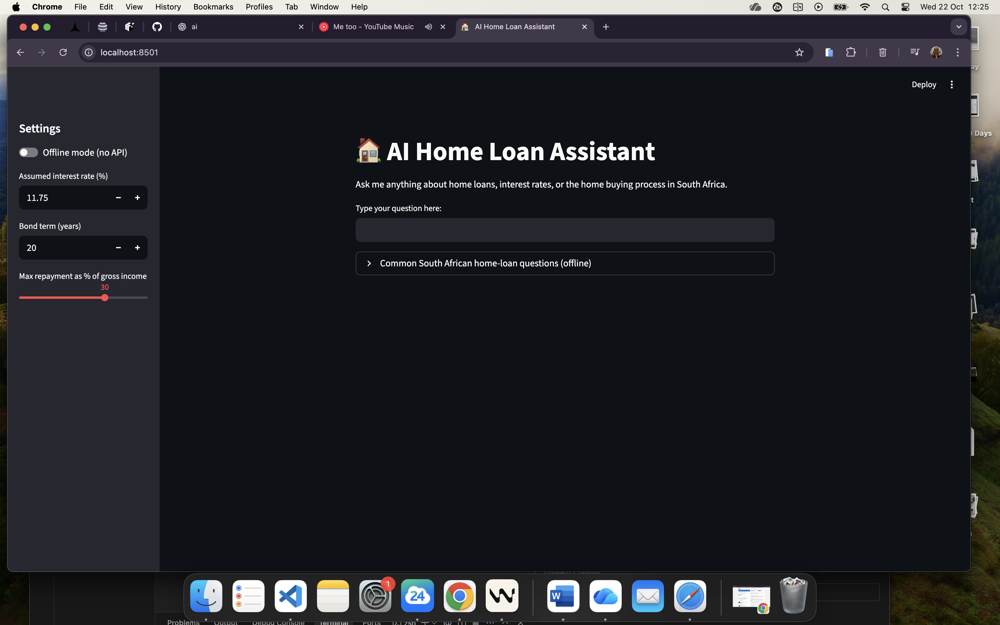

# 🏠 AI Home Loan Assistant (South Africa)
Live Link:https://ai-home-loan-assistant-irnxzkyfywiuiltfyrgaru.streamlit.app/

A simple Streamlit app where you can ask home-loan questions and get clear answers. It supports:
- Online mode (OpenAI GPT-4o-mini)
- Offline mode (no API required): affordability calculator + quick FAQs

## Demo Screenshots
Place screenshots in the `screenshots/` folder and they will appear below automatically.

- Home screen: 
- Offline affordability result: 

> Tip: You can take screenshots with Shift+Cmd+4 (macOS) and save them into the `screenshots/` folder as `home.png` and `offline-affordability.png`.

---

## 1) Requirements
- Python 3.9+ (Python 3.13 works too)
- pip (or use `python3 -m pip` on macOS)

Install dependencies:

```bash
python3 -m pip install -r requirements.txt
```

---

## 2) Configure your OpenAI API key (optional)
If you plan to use online AI answers:

1. Get a key at https://platform.openai.com/api-keys
2. Add it to `.env`:

```
OPENAI_API_KEY=sk-...your_key_here...
```

Security:
- Never commit real keys to GitHub (this repo’s `.gitignore` already ignores `.env`).
- You may need to add billing to use the API: https://platform.openai.com/settings/organization/billing

> If you don’t have an API key or billing, just use the app in Offline mode (see below).

---

## 3) Run the app
From the project folder:

```bash
streamlit run app.py
```

If `pip` is not found or Streamlit doesn’t start, use:

```bash
python3 -m streamlit run app.py
```

Open the URL shown in the terminal (usually http://localhost:8501). If it doesn’t open, try:
- http://127.0.0.1:8501
- Or run on a different port:

```bash
python3 -m streamlit run app.py --server.port 8502
```

---

## 4) Using the app
- In the left sidebar, toggle **Offline mode (no API)** ON to avoid OpenAI usage.
- Ask an affordability question including your monthly income, e.g.:
  - “I earn R20,000 per month — how much can I borrow?”
- Adjust assumptions in the sidebar:
  - Interest rate (default 11.75%)
  - Loan term (default 20 years)
  - Repayment cap (% of gross income, default 30%)

What you’ll see in Offline mode:
- An estimated maximum bond amount using an annuity formula.
- A list of assumptions and a quick note that final approval depends on lender criteria.
- A “Common South African home-loan questions (offline)” expander with quick guidance.

---

## 5) Troubleshooting
- “This site can’t be reached / refused to connect”
  - Make sure the Streamlit server is running in the terminal
  - Try a different port: `python3 -m streamlit run app.py --server.port 8503`
  - Open directly in Chrome: `open -a "Google Chrome" http://127.0.0.1:8503`
- `pip: command not found`
  - Use `python3 -m pip install -r requirements.txt`
- OpenAI quota / billing error (429 insufficient_quota)
  - Use Offline mode, or add a payment method on your OpenAI account
- Environment variables not detected
  - Ensure `.env` is in the project root and restart Streamlit

---

## 6) Project structure
```
home_loan_assistant/
├─ app.py                # Streamlit app
├─ requirements.txt      # Dependencies
├─ .env                  # (Optional) OpenAI key, not committed
├─ .gitignore            # Ignores .env, caches, etc.
├─ screenshots/          # Put your screenshots here
│  ├─ home.png
│  └─ offline-affordability.png
└─ README.md
```

---

## 7) Notes & Credits
- Built with Python + Streamlit
- OpenAI API optional; offline mode includes local affordability estimates and FAQs
- South African context (transfer costs, bond registration, etc.) is covered in the offline FAQ


